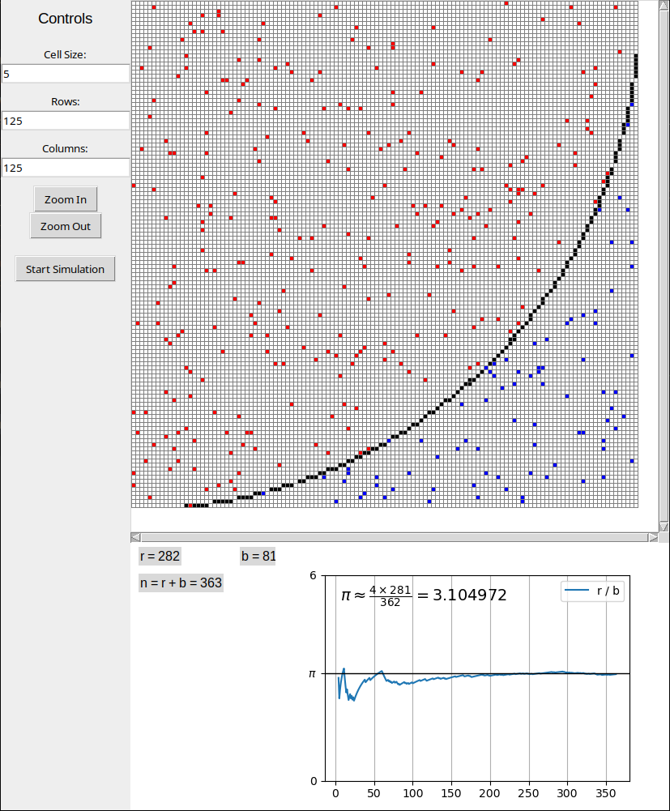

# Monte Carlo π Estimator & Visualizer

A real-time visual simulation of the Monte Carlo method to estimate π.

---

## What It Does

This project demonstrates the classic Monte Carlo technique for estimating π:

- Randomly generates points within a square
- Checks if they fall inside a unit circle
- Uses the ratio `π ≈ 4 × (points inside) / (total points)` to estimate π
- Displays live stats and convergence on a graph

Monte Carlo methods are foundational in scientific computing and quantitative finance.  
The program demonstrates how statistical estimation, randomness, and convergence can come together in a visually intuitive way — great for learning or teaching.

---

## Preview

 <!-- Add a screen recording or gif if you'd like -->

---

## Requirements

Python 3.6+

Install required packages:

```bash
pip install numpy
pip install matplotlib
```